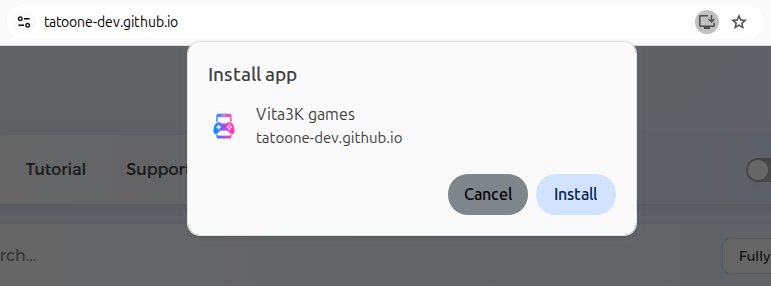

# Vita3K Games Database Description

The Vita3K Games database is a collection that store metadata for PlayStation Vita games compatible with the Vita3K emulator. Each file corresponds to games with different playability ratings (3: Fully Playable, 2: Playable, 1: At Least Playable). The database is used to populate a searchable table on the Vita3K Games website, providing users with game details, download links, and purchase options.

## Usage

- **Searchable Table**: The website loads one JSON file at a time based on the selected playability rating. Users can search across all fields (e.g., title, region) to filter games.
- **Downloads**: Provides links to download PKG files and generate `work.bin` files using the zRIF license.
- **Purchase Links**: Links to eBay for purchasing physical copies.
- **Details View**: Clicking a game title reveals additional metadata (e.g., Title ID, versions, rating).

## Installation
You can simply click the install icon on the navbar of your browser to install it on your platform (Google Chrome, Windows, Linux).

## Notes

- **Legal Compliance**: Users are reminded via a DMCA modal to legally own games before downloading.
- **Data Source**: JSON files are assumed to be hosted locally or fetched from a server.
- **Maintenance**: The database can be updated by modifying the JSON files to include new games or update existing ones.

This database enables an efficient and user-friendly interface for Vita3K emulator users to discover and access compatible games.
